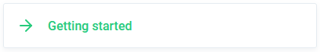

<div align="center"> 
   
</div>

<p align="center">
  <a href="https://www.npmjs.com/package/vue-teddy-store"></a>
  <a href="https://www.npmjs.com/package/vue-teddy-store"></a>
  <a href="https://www.npmjs.com/package/vue-teddy-store"></a>
  <a href="https://github.com/gahabeen/vue-teddy-store"></a>
</p>

<div align="center"> 
  <a href="http://vueteddystore.com" target="_blank">Documentation - vueteddystore.com</a>
</div>

## What is Vue Teddy Store?

Vue Teddy Store is the easiest - next-generation - store for Vue application. <a href="http://vueteddystore.com" target="_blank">Check out the documentation</a> to find more about its minimal & delightful API.

<br />  

<div align="center"> 
  <a href="http://vueteddystore.com" target="_blank">
     
  </a>
</div>  

<br />  


## Example

```html
<!-- start of .vue file -->
<script>
  import { sync } from 'vue-teddy-store'

  export default {
    computed: {
      products: sync('products.items'),
    },
  }
</script>
<!-- End of .vue file -->

<script>
  /* part of your main.js file */
  import Vue from 'vue'
  import TeddyStore from 'vue-teddy-store'

  const stores = new TeddyStore()

  stores.add('products', {
    state: {
      items: [
        {
          name: 'Berries',
        },
      ],
    },
  })

  Vue.use(stores)
  /* end part of your main.js file */
</script>
```

## Contributing

Vue Teddy Store is and always will be _free_ and _open source_.

#### Core Codebase Contributors

This project, so far, exists only because of the will of one person. If you use it and thinks it should become better, cover more cases or be more stable, consider pushing `pull requests` as well as reaching out through `issues` for ideas, bugs and questions.

<a href="https://github.com/gahabeen/vue-teddy-store/graphs/contributors"></a>

## License

[MIT](https://opensource.org/licenses/MIT)

Copyright (c) 2020-present, Gabin Desserprit
